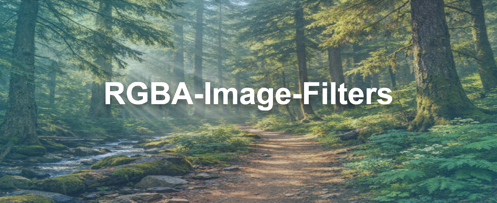

# 🌈 RGBA-Image-Filters
A small Swift image processing playground that applies per-pixel filters using a custom RGBAImage type.

## Current Included Filters:
- Negative Filter
- Freeze Filter
- Grayscale Filter
- Sepia Filter
- Dim Filter

All of these can be defined and mixed and matched from one line of code (available list of all filters above):
```swift
let result = imageProcessor.filteredImage(filterNames: ["Sepia Filter", "Dim Filter"])?.toUIImage()
```
> Example of Sepia and Dim Filter enabled:

<br/>
